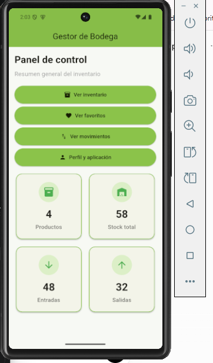
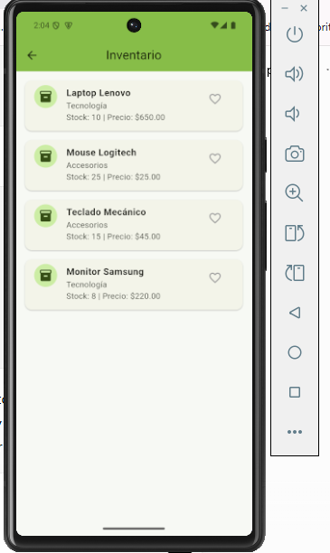
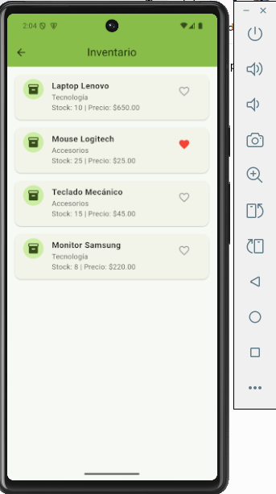
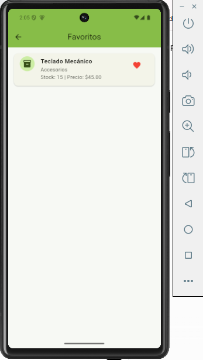
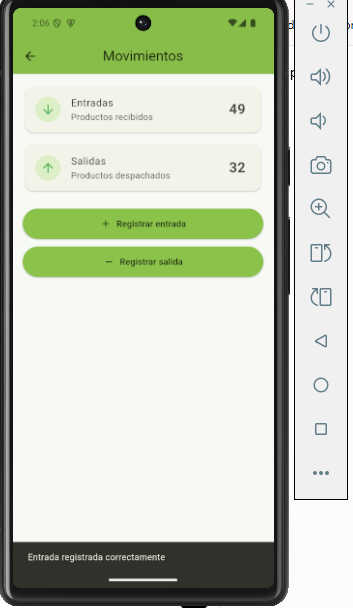
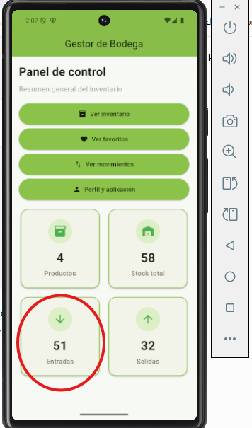
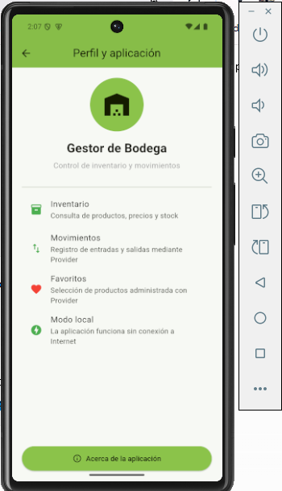

# Proyecto Flutter - Actividades Integradoras

## Autor

Gregorio Garzon

---

# Actividad Integradora 1

## Mi Primera Aplicacion en Flutter

### Descripcion

La primera actividad consistio en desarrollar una aplicacion basica en Flutter denominada "Mi Perfil Profesional".

La aplicacion presenta informacion relacionada con la formacion, experiencia, habilidades y objetivo profesional del estudiante.

Esta actividad permitio aplicar los conceptos iniciales de Flutter y comprobar el funcionamiento del entorno de desarrollo.

### Funcionalidades principales

- Presentacion de informacion profesional.
- Visualizacion de formacion academica.
- Visualizacion de experiencia profesional.
- Presentacion de habilidades tecnologicas.
- Uso de diferentes widgets de Flutter.
- Boton para mostrar u ocultar informacion.
- Ejecucion en emulador Android.

### Widgets utilizados

- `MaterialApp`
- `Scaffold`
- `AppBar`
- `Text`
- `Icon`
- `Column`
- `Row`
- `Container`
- `Card`
- `CircleAvatar`
- `ElevatedButton`
- `SingleChildScrollView`

### Interaccion

La aplicacion cuenta con un boton que permite mostrar u ocultar el objetivo profesional.

Esta funcionalidad permite demostrar interaccion con el usuario y actualizacion de la interfaz.

### Paquete externo

En la primera actividad se utilizo:

`google_fonts`

Este paquete permitio utilizar fuentes adicionales dentro de la aplicacion.

### Evidencias de la Actividad 1

Las evidencias se encuentran en la carpeta:

`capturas`

#### Flutter Doctor


#### Proyecto en Visual Studio Code


#### Aplicacion en el emulador Android


#### Funcionamiento del boton


#### Paquete Google Fonts


---

# Actividad Integradora 2

## Gestor de Bodega

### Descripcion

Para la Actividad Integradora 2 se continuo trabajando sobre el proyecto Flutter desarrollado en la Actividad Integradora 1.

La aplicacion fue transformada en un sistema denominado:

**Gestor de Bodega**

El objetivo de la aplicacion es presentar una solucion basica para consultar productos de inventario y controlar movimientos de entrada y salida de una bodega.

El proyecto fue ampliado mediante nuevas pantallas, navegacion con Navigator, widgets reutilizables, interacciones con el usuario, manejo de estado mediante setState, uso de un paquete externo y personalizacion visual.

---

## Pantallas desarrolladas

La aplicacion contiene cuatro pantallas principales.

### 1. Inicio

La pantalla Inicio funciona como panel de control.

Presenta un resumen general mediante tarjetas con informacion de:

- Productos.
- Stock total.
- Entradas.
- Salidas.

Desde esta pantalla se puede navegar hacia Inventario, Movimientos y Perfil.

### 2. Inventario

La pantalla Inventario presenta una lista de productos almacenados.

Cada producto contiene:

- Nombre.
- Categoria.
- Cantidad disponible.
- Precio.
- Opcion para marcar como favorito.

Los productos se muestran utilizando `ListView`, `Card`, `ListTile`, `CircleAvatar`, `Icon` e `IconButton`.

### 3. Movimientos

La pantalla Movimientos permite simular el control de entradas y salidas de productos.

La aplicacion permite:

- Registrar nuevas entradas.
- Registrar nuevas salidas.
- Incrementar los contadores.
- Mostrar mensajes de confirmacion.
- Solicitar confirmacion antes de registrar una salida.

### 4. Perfil y aplicacion

Esta pantalla presenta informacion general sobre Gestor de Bodega.

Tambien incluye:

- Identidad visual de la aplicacion.
- Informacion sobre sus principales funciones.
- Boton para visitar el sitio de Flutter.
- Ventana Acerca de la aplicacion.

---

## Navegacion

La navegacion entre las diferentes pantallas fue implementada mediante:

`Navigator.push()`

y:

`MaterialPageRoute`

Desde la pantalla principal se puede acceder a las pantallas Inventario, Movimientos y Perfil.

---

## Widgets utilizados

Durante la Actividad Integradora 2 se utilizaron diferentes widgets de Flutter, entre ellos:

- `MaterialApp`
- `Scaffold`
- `AppBar`
- `ListView`
- `GridView`
- `ListTile`
- `Card`
- `CircleAvatar`
- `Divider`
- `Icon`
- `IconButton`
- `ElevatedButton`
- `Padding`
- `SizedBox`
- `Expanded`
- `Container`
- `AlertDialog`
- `SnackBar`

Esto supera el requisito minimo de cinco widgets adicionales.

---

## Interacciones implementadas

La aplicacion contiene varias interacciones con el usuario.

### Productos favoritos

En la pantalla Inventario se puede presionar el icono de corazon para agregar o eliminar un producto de favoritos.

La interfaz cambia inmediatamente y se muestra un `SnackBar` informando la accion realizada.

### Registro de entradas

En la pantalla Movimientos, el boton Registrar entrada incrementa el contador de entradas y muestra un mensaje mediante `SnackBar`.

### Registro de salidas

El boton Registrar salida presenta un `AlertDialog`.

El usuario puede cancelar la operacion o confirmar la salida.

Cuando se confirma, el contador aumenta y se muestra un `SnackBar`.

### Navegacion

Los botones de la pantalla Inicio permiten cambiar entre las diferentes pantallas utilizando `Navigator`.

---

## Uso de setState

La aplicacion utiliza `setState()` para actualizar dinamicamente la interfaz.

Se utiliza principalmente en:

- Cambio del estado favorito de los productos.
- Incremento del contador de entradas.
- Incremento del contador de salidas.

Cuando cambia uno de estos valores, Flutter reconstruye la parte correspondiente de la interfaz y presenta inmediatamente el nuevo estado.

---

## Paquete externo

Para la Actividad Integradora 2 se utilizo el paquete:

`url_launcher`

Este paquete permite abrir enlaces externos desde una aplicacion Flutter.

Fue implementado en la pantalla Perfil y aplicacion mediante el boton:

**Visitar Flutter**

Al presionar el boton, la aplicacion intenta abrir el sitio oficial de Flutter utilizando el navegador del dispositivo.

---

## Personalizacion

La aplicacion fue personalizada para diferenciarla del proyecto inicial.

### Nombre

El nombre utilizado es:

**Gestor de Bodega**

### Colores

Se implemento una identidad visual basada principalmente en verde lima.

Color principal utilizado:

`#8BC34A`

### Logo

Se creo un logo relacionado con la gestion de bodegas.

El archivo utilizado se encuentra en:

`assets/icon/app_icon.png`

### Icono Android

Se utilizo el paquete de desarrollo:

`flutter_launcher_icons`

para generar automaticamente los iconos Android a partir del logo de Gestor de Bodega.

La configuracion se encuentra en:

`flutter_launcher_icons.yaml`

---

## Organizacion del proyecto

El proyecto fue organizado utilizando carpetas separadas para modelos, pantallas, widgets, recursos y evidencias.

```text
mi_app/
|
|-- android/
|-- assets/
|   |-- icon/
|       |-- app_icon.png
|
|-- capturas/
|-- capturas_actividad2/
|
|-- lib/
|   |-- main.dart
|   |
|   |-- models/
|   |   |-- product.dart
|   |
|   |-- screens/
|   |   |-- home_screen.dart
|   |   |-- inventory_screen.dart
|   |   |-- movements_screen.dart
|   |   |-- profile_screen.dart
|   |
|   |-- widgets/
|       |-- summary_card.dart
|
|-- flutter_launcher_icons.yaml
|-- pubspec.yaml
|-- pubspec.lock
|-- README.md
```

Esta estructura permite mantener el codigo organizado y facilita futuras modificaciones.

---

## Evidencias de la Actividad 2

Las capturas correspondientes a esta actividad se encuentran en:

`capturas_actividad2`

### Pantalla de inicio


### Pantalla de inventario


### Funcion de favoritos


### Pantalla de movimientos


### Pantalla de perfil


---

## Tecnologias utilizadas

- Flutter
- Dart
- Android Studio
- Visual Studio Code
- Android Emulator
- Git
- GitHub

---

## Ejecucion del proyecto

Para ejecutar el proyecto se debe tener Flutter instalado y configurado correctamente.

Primero se debe clonar o descargar el repositorio.

Luego ingresar a la carpeta del proyecto.

Instalar las dependencias:

```bash
flutter pub get
```

Comprobar la configuracion de Flutter:

```bash
flutter doctor
```

Verificar los dispositivos disponibles:

```bash
flutter devices
```

Ejecutar la aplicacion:

```bash
flutter run
```

Durante el desarrollo de esta actividad se utilizo un emulador Android Pixel 7.

---

## Control de versiones

El proyecto utiliza Git para controlar los cambios realizados durante el desarrollo.

La Actividad Integradora 2 fue desarrollada utilizando una rama independiente denominada:

`actividad-integradora-2`

Se realizaron mas de diez commits para documentar progresivamente el desarrollo de la aplicacion.

---

## Estado del proyecto

**Actividad Integradora 1:** Completada.

**Actividad Integradora 2:** Completada.

La aplicacion Gestor de Bodega fue desarrollada, personalizada y probada correctamente en un emulador Android.

El proyecto contiene navegacion entre cuatro pantallas, interacciones con el usuario, manejo de estado mediante setState, paquete externo, widgets reutilizables, personalizacion visual, logo propio, icono Android y evidencias de funcionamiento.

---

# Actividad Integradora 3

## Gestor de Bodega - Implementacion de Provider

### Descripcion

Para la Actividad Integradora 3 se continuo desarrollando la aplicacion Gestor de Bodega creada en las actividades anteriores.

En esta nueva version se mejoro la arquitectura del proyecto mediante la implementacion del paquete Provider para el manejo de estado, la creacion de nuevos widgets reutilizables y una mayor separacion de responsabilidades entre modelos, providers, pantallas y componentes visuales.

La aplicacion permite administrar un inventario de productos, seleccionar productos favoritos, registrar movimientos de entrada y salida y visualizar indicadores actualizados desde un panel de control.

La aplicacion fue desarrollada para funcionar de manera local, sin depender de conexion a Internet para sus funciones principales.

---

## Objetivo

Desarrollar y mejorar una aplicacion movil utilizando Flutter, aplicando manejo de estado mediante Provider, organizacion del codigo en diferentes archivos y carpetas, widgets reutilizables, navegacion entre pantallas y control de versiones mediante Git y GitHub.

---

## Funcionalidades principales

La aplicacion cuenta con las siguientes funcionalidades:

- Visualizacion del inventario de productos.
- Consulta de nombre, categoria, stock y precio.
- Seleccion y eliminacion de productos favoritos.
- Pantalla independiente para visualizar favoritos.
- Registro de entradas de inventario.
- Registro de salidas con ventana de confirmacion.
- Actualizacion automatica de los indicadores del panel principal.
- Navegacion entre las diferentes pantallas.
- Mensajes de confirmacion mediante SnackBar.
- Funcionamiento local sin necesidad de conexion a Internet.

---

## Pantallas de la aplicacion

### 1. Inicio

La pantalla principal funciona como panel de control de Gestor de Bodega.

Permite acceder a:

- Inventario.
- Favoritos.
- Movimientos.
- Perfil y aplicacion.

Tambien muestra indicadores dinamicos de:

- Cantidad de productos.
- Stock total.
- Entradas.
- Salidas.

Estos valores son obtenidos directamente desde InventoryProvider.

### 2. Inventario

Presenta los productos mediante una lista dinamica.

Cada producto contiene:

- Nombre.
- Categoria.
- Stock.
- Precio.
- Boton de favorito.

La pantalla utiliza Consumer para escuchar los cambios realizados en InventoryProvider.

### 3. Favoritos

Presenta solamente los productos marcados como favoritos.

Cuando un producto es marcado como favorito desde Inventario, el cambio se almacena en el Provider y se refleja en esta pantalla.

Tambien es posible eliminar un producto de favoritos y observar el cambio posteriormente en Inventario.

### 4. Movimientos

Permite registrar entradas y salidas de inventario.

Los contadores son administrados mediante InventoryProvider.

Al registrar un movimiento se ejecuta notifyListeners(), permitiendo que los cambios se reflejen tambien en el panel principal.

### 5. Perfil y aplicacion

Presenta informacion sobre Gestor de Bodega y sus principales funcionalidades.

La pantalla tambien informa que la aplicacion utiliza Provider y que sus funciones principales trabajan de manera local.

---

## Implementacion de Provider

Para la Actividad Integradora 3 se instalo el paquete:

`provider`

El manejo del estado principal se encuentra en:

`lib/providers/inventory_provider.dart`

InventoryProvider extiende ChangeNotifier y administra informacion compartida entre diferentes pantallas.

Entre los estados administrados se encuentran:

- Lista de productos.
- Productos favoritos.
- Cantidad de entradas.
- Cantidad de salidas.
- Cantidad total de productos.
- Stock total.

Para notificar los cambios se utiliza:

```dart
notifyListeners();
```

El Provider se registra en `main.dart` mediante:

```dart
ChangeNotifierProvider(
  create: (_) => InventoryProvider(),
  child: const MyApp(),
)
```

Las pantallas pueden escuchar los cambios mediante:

```dart
Consumer<InventoryProvider>
```

Esto permite que un cambio realizado en una pantalla se refleje automaticamente en otros componentes de la aplicacion.

---

## Evidencia del manejo de estado

Un ejemplo del funcionamiento de Provider es la administracion de favoritos.

El flujo es:

1. El usuario ingresa a Inventario.
2. Selecciona el icono de corazon de un producto.
3. Se ejecuta `toggleFavorite()`.
4. InventoryProvider modifica el estado del producto.
5. Se ejecuta `notifyListeners()`.
6. La pantalla se reconstruye automaticamente.
7. Al ingresar a Favoritos, el producto seleccionado aparece en la lista.

El mismo principio se utiliza para las entradas y salidas.

Cuando se registra una entrada o salida desde Movimientos, el panel principal muestra automaticamente los nuevos valores.

---

## Modelo de datos

La aplicacion utiliza la clase:

`Product`

Ubicada en:

`lib/models/product.dart`

El modelo representa cada producto del inventario y contiene:

```dart
class Product {
  final String name;
  final String category;
  int stock;
  final double price;
  bool isFavorite;
}
```

Esto permite separar la representacion de los datos de la interfaz grafica.

---

## Widgets reutilizables

Para evitar repetir codigo se implementaron widgets personalizados en archivos independientes.

### ProductCard

Ubicado en:

`lib/widgets/product_card.dart`

Este widget representa visualmente un producto y puede utilizarse tanto en Inventario como en Favoritos.

Presenta:

- Nombre.
- Categoria.
- Stock.
- Precio.
- Boton de favorito.

### FavoriteButton

Ubicado en:

`lib/widgets/favorite_button.dart`

Controla visualmente el estado favorito mediante un icono de corazon.

### SummaryCard

Ubicado en:

`lib/widgets/summary_card.dart`

Se utiliza en el panel principal para presentar los indicadores de productos, stock, entradas y salidas.

---

## Organizacion del proyecto

La estructura principal utilizada en la Actividad Integradora 3 es:

```text
lib/
|
|-- main.dart
|
|-- models/
|   |-- product.dart
|
|-- providers/
|   |-- inventory_provider.dart
|
|-- screens/
|   |-- home_screen.dart
|   |-- inventory_screen.dart
|   |-- favorites_screen.dart
|   |-- movements_screen.dart
|   |-- profile_screen.dart
|
|-- widgets/
    |-- favorite_button.dart
    |-- product_card.dart
    |-- summary_card.dart
```

Esta organizacion permite separar las responsabilidades y evita concentrar toda la aplicacion dentro de `main.dart`.

---

## Navegacion

La aplicacion utiliza:

```dart
Navigator.push()
```

junto con:

```dart
MaterialPageRoute
```

para navegar entre las diferentes pantallas.

El usuario puede regresar utilizando el comportamiento de navegacion proporcionado por Navigator.

---

## Diseño de interfaz

La aplicacion mantiene una identidad visual coherente relacionada con la gestion de bodegas.

Se utiliza principalmente el color verde lima:

`#8BC34A`

La configuracion general se centraliza mediante `ThemeData`.

La interfaz utiliza:

- Cards.
- Iconos.
- Botones.
- Listas dinamicas.
- Espaciado consistente.
- Bordes redondeados.
- Indicadores visuales.
- Mensajes SnackBar.
- AlertDialog.

Los elementos principales utilizados por la aplicacion son locales y no dependen de recursos externos para funcionar.

---

## Tecnologias y paquetes utilizados

- Flutter.
- Dart.
- Provider.
- Material Design.
- Android Emulator.
- Visual Studio Code.
- Git.
- GitHub.

El paquete Provider es utilizado para el manejo centralizado del estado de la aplicacion.

---

## Ejecucion del proyecto

Para ejecutar el proyecto se debe tener Flutter instalado y correctamente configurado.

Instalar las dependencias:

```bash
flutter pub get
```

Comprobar el proyecto:

```bash
flutter analyze
```

Verificar los dispositivos disponibles:

```bash
flutter devices
```

Ejecutar la aplicacion:

```bash
flutter run
```

Durante las pruebas de la Actividad Integradora 3 se utilizo un emulador Pixel 6 con Android 15 API 35.

---

## Evidencias de la Actividad 3

Las capturas de pantalla se encuentran en:

`capturas_actividad3`

### Pantalla de inicio



### Pantalla de inventario



### Producto marcado como favorito



### Pantalla de favoritos



### Pantalla de movimientos



### Actualizacion de indicadores mediante Provider



### Pantalla de perfil



---

## Control de versiones

La Actividad Integradora 3 fue desarrollada en la rama:

`actividad-integradora-3`

Durante el desarrollo se realizaron commits significativos para registrar progresivamente la evolucion de la aplicacion.

Entre los cambios realizados se encuentran:

- Instalacion y configuracion de Provider.
- Implementacion de InventoryProvider.
- Creacion de widgets reutilizables.
- Implementacion de favoritos mediante Provider.
- Integracion de movimientos y panel principal con Provider.
- Mejoras visuales y funcionamiento local.
- Documentacion y evidencias finales.

---

## Autor

**Gregorio Garzon**

---

## Estado del proyecto

**Actividad Integradora 1:** Completada.

**Actividad Integradora 2:** Completada.

**Actividad Integradora 3:** Completada.

Gestor de Bodega cuenta actualmente con una arquitectura organizada mediante modelos, providers, pantallas y widgets reutilizables.

La aplicacion utiliza Provider para compartir y actualizar el estado entre diferentes componentes, mantiene navegacion entre sus pantallas y puede ejecutarse correctamente en un emulador Android.