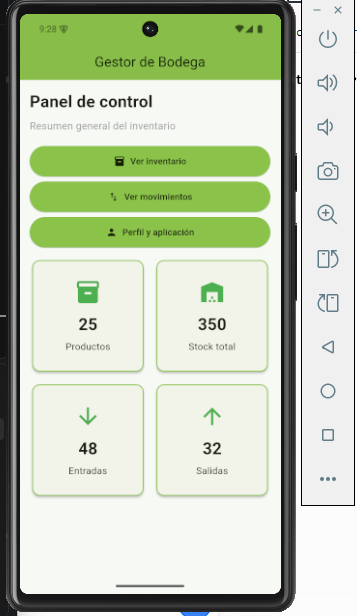
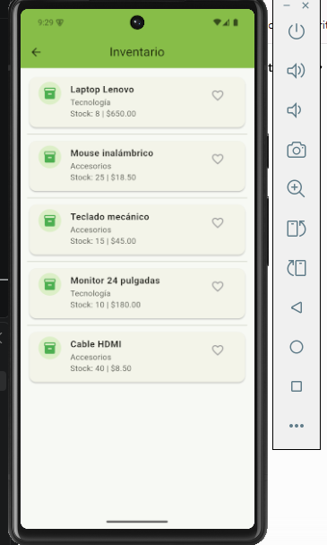
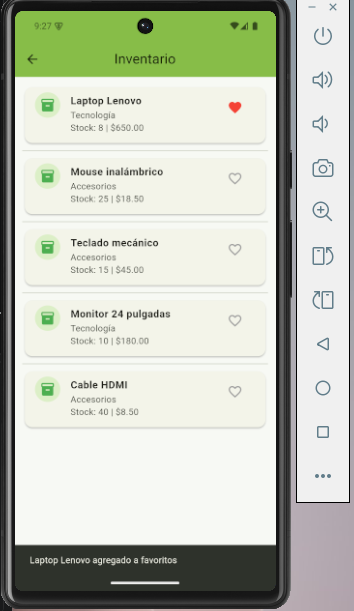
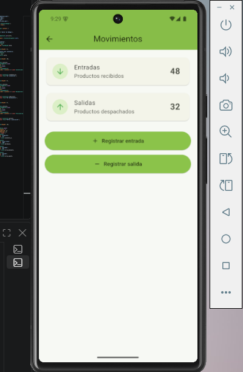
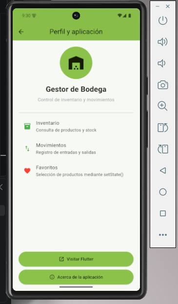

# Proyecto Flutter - Actividades Integradoras

## Autor

Gregorio Garzon

---

# Actividad Integradora 1

## Mi Primera Aplicacion en Flutter

### Descripcion

La primera actividad consistio en desarrollar una aplicacion basica en Flutter denominada "Mi Perfil Profesional".

La aplicacion presenta informacion relacionada con la formacion, experiencia, habilidades y objetivo profesional del estudiante.

Esta actividad permitio aplicar los conceptos iniciales de Flutter y comprobar el funcionamiento del entorno de desarrollo.

### Funcionalidades principales

- Presentacion de informacion profesional.
- Visualizacion de formacion academica.
- Visualizacion de experiencia profesional.
- Presentacion de habilidades tecnologicas.
- Uso de diferentes widgets de Flutter.
- Boton para mostrar u ocultar informacion.
- Ejecucion en emulador Android.

### Widgets utilizados

- `MaterialApp`
- `Scaffold`
- `AppBar`
- `Text`
- `Icon`
- `Column`
- `Row`
- `Container`
- `Card`
- `CircleAvatar`
- `ElevatedButton`
- `SingleChildScrollView`

### Interaccion

La aplicacion cuenta con un boton que permite mostrar u ocultar el objetivo profesional.

Esta funcionalidad permite demostrar interaccion con el usuario y actualizacion de la interfaz.

### Paquete externo

En la primera actividad se utilizo:

`google_fonts`

Este paquete permitio utilizar fuentes adicionales dentro de la aplicacion.

### Evidencias de la Actividad 1

Las evidencias se encuentran en la carpeta:

`capturas`

#### Flutter Doctor


#### Proyecto en Visual Studio Code


#### Aplicacion en el emulador Android


#### Funcionamiento del boton


#### Paquete Google Fonts


---

# Actividad Integradora 2

## Gestor de Bodega

### Descripcion

Para la Actividad Integradora 2 se continuo trabajando sobre el proyecto Flutter desarrollado en la Actividad Integradora 1.

La aplicacion fue transformada en un sistema denominado:

**Gestor de Bodega**

El objetivo de la aplicacion es presentar una solucion basica para consultar productos de inventario y controlar movimientos de entrada y salida de una bodega.

El proyecto fue ampliado mediante nuevas pantallas, navegacion con Navigator, widgets reutilizables, interacciones con el usuario, manejo de estado mediante setState, uso de un paquete externo y personalizacion visual.

---

## Pantallas desarrolladas

La aplicacion contiene cuatro pantallas principales.

### 1. Inicio

La pantalla Inicio funciona como panel de control.

Presenta un resumen general mediante tarjetas con informacion de:

- Productos.
- Stock total.
- Entradas.
- Salidas.

Desde esta pantalla se puede navegar hacia Inventario, Movimientos y Perfil.

### 2. Inventario

La pantalla Inventario presenta una lista de productos almacenados.

Cada producto contiene:

- Nombre.
- Categoria.
- Cantidad disponible.
- Precio.
- Opcion para marcar como favorito.

Los productos se muestran utilizando `ListView`, `Card`, `ListTile`, `CircleAvatar`, `Icon` e `IconButton`.

### 3. Movimientos

La pantalla Movimientos permite simular el control de entradas y salidas de productos.

La aplicacion permite:

- Registrar nuevas entradas.
- Registrar nuevas salidas.
- Incrementar los contadores.
- Mostrar mensajes de confirmacion.
- Solicitar confirmacion antes de registrar una salida.

### 4. Perfil y aplicacion

Esta pantalla presenta informacion general sobre Gestor de Bodega.

Tambien incluye:

- Identidad visual de la aplicacion.
- Informacion sobre sus principales funciones.
- Boton para visitar el sitio de Flutter.
- Ventana Acerca de la aplicacion.

---

## Navegacion

La navegacion entre las diferentes pantallas fue implementada mediante:

`Navigator.push()`

y:

`MaterialPageRoute`

Desde la pantalla principal se puede acceder a las pantallas Inventario, Movimientos y Perfil.

---

## Widgets utilizados

Durante la Actividad Integradora 2 se utilizaron diferentes widgets de Flutter, entre ellos:

- `MaterialApp`
- `Scaffold`
- `AppBar`
- `ListView`
- `GridView`
- `ListTile`
- `Card`
- `CircleAvatar`
- `Divider`
- `Icon`
- `IconButton`
- `ElevatedButton`
- `Padding`
- `SizedBox`
- `Expanded`
- `Container`
- `AlertDialog`
- `SnackBar`

Esto supera el requisito minimo de cinco widgets adicionales.

---

## Interacciones implementadas

La aplicacion contiene varias interacciones con el usuario.

### Productos favoritos

En la pantalla Inventario se puede presionar el icono de corazon para agregar o eliminar un producto de favoritos.

La interfaz cambia inmediatamente y se muestra un `SnackBar` informando la accion realizada.

### Registro de entradas

En la pantalla Movimientos, el boton Registrar entrada incrementa el contador de entradas y muestra un mensaje mediante `SnackBar`.

### Registro de salidas

El boton Registrar salida presenta un `AlertDialog`.

El usuario puede cancelar la operacion o confirmar la salida.

Cuando se confirma, el contador aumenta y se muestra un `SnackBar`.

### Navegacion

Los botones de la pantalla Inicio permiten cambiar entre las diferentes pantallas utilizando `Navigator`.

---

## Uso de setState

La aplicacion utiliza `setState()` para actualizar dinamicamente la interfaz.

Se utiliza principalmente en:

- Cambio del estado favorito de los productos.
- Incremento del contador de entradas.
- Incremento del contador de salidas.

Cuando cambia uno de estos valores, Flutter reconstruye la parte correspondiente de la interfaz y presenta inmediatamente el nuevo estado.

---

## Paquete externo

Para la Actividad Integradora 2 se utilizo el paquete:

`url_launcher`

Este paquete permite abrir enlaces externos desde una aplicacion Flutter.

Fue implementado en la pantalla Perfil y aplicacion mediante el boton:

**Visitar Flutter**

Al presionar el boton, la aplicacion intenta abrir el sitio oficial de Flutter utilizando el navegador del dispositivo.

---

## Personalizacion

La aplicacion fue personalizada para diferenciarla del proyecto inicial.

### Nombre

El nombre utilizado es:

**Gestor de Bodega**

### Colores

Se implemento una identidad visual basada principalmente en verde lima.

Color principal utilizado:

`#8BC34A`

### Logo

Se creo un logo relacionado con la gestion de bodegas.

El archivo utilizado se encuentra en:

`assets/icon/app_icon.png`

### Icono Android

Se utilizo el paquete de desarrollo:

`flutter_launcher_icons`

para generar automaticamente los iconos Android a partir del logo de Gestor de Bodega.

La configuracion se encuentra en:

`flutter_launcher_icons.yaml`

---

## Organizacion del proyecto

El proyecto fue organizado utilizando carpetas separadas para modelos, pantallas, widgets, recursos y evidencias.

```text
mi_app/
|
|-- android/
|-- assets/
|   |-- icon/
|       |-- app_icon.png
|
|-- capturas/
|-- capturas_actividad2/
|
|-- lib/
|   |-- main.dart
|   |
|   |-- models/
|   |   |-- product.dart
|   |
|   |-- screens/
|   |   |-- home_screen.dart
|   |   |-- inventory_screen.dart
|   |   |-- movements_screen.dart
|   |   |-- profile_screen.dart
|   |
|   |-- widgets/
|       |-- summary_card.dart
|
|-- flutter_launcher_icons.yaml
|-- pubspec.yaml
|-- pubspec.lock
|-- README.md
```

Esta estructura permite mantener el codigo organizado y facilita futuras modificaciones.

---

## Evidencias de la Actividad 2

Las capturas correspondientes a esta actividad se encuentran en:

`capturas_actividad2`

### Pantalla de inicio



### Pantalla de inventario



### Funcion de favoritos



### Pantalla de movimientos



### Pantalla de perfil



---

## Tecnologias utilizadas

- Flutter
- Dart
- Android Studio
- Visual Studio Code
- Android Emulator
- Git
- GitHub

---

## Ejecucion del proyecto

Para ejecutar el proyecto se debe tener Flutter instalado y configurado correctamente.

Primero se debe clonar o descargar el repositorio.

Luego ingresar a la carpeta del proyecto.

Instalar las dependencias:

```bash
flutter pub get
```

Comprobar la configuracion de Flutter:

```bash
flutter doctor
```

Verificar los dispositivos disponibles:

```bash
flutter devices
```

Ejecutar la aplicacion:

```bash
flutter run
```

Durante el desarrollo de esta actividad se utilizo un emulador Android Pixel 7.

---

## Control de versiones

El proyecto utiliza Git para controlar los cambios realizados durante el desarrollo.

La Actividad Integradora 2 fue desarrollada utilizando una rama independiente denominada:

`actividad-integradora-2`

Se realizaron mas de diez commits para documentar progresivamente el desarrollo de la aplicacion.

---

## Estado del proyecto

**Actividad Integradora 1:** Completada.

**Actividad Integradora 2:** Completada.

La aplicacion Gestor de Bodega fue desarrollada, personalizada y probada correctamente en un emulador Android.

El proyecto contiene navegacion entre cuatro pantallas, interacciones con el usuario, manejo de estado mediante setState, paquete externo, widgets reutilizables, personalizacion visual, logo propio, icono Android y evidencias de funcionamiento.